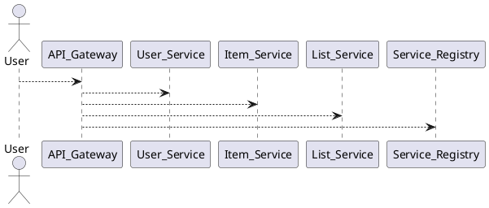
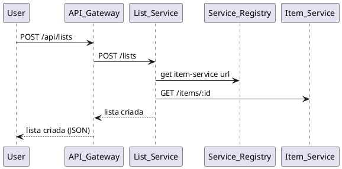

# 🛒 Lista de Compras – Microsserviços

## 📌 Visão Geral
Sistema distribuído para **gerenciamento de listas de compras**, implementado com **Node.js + Express**, arquitetura de **microsserviços**, **API Gateway** e **Service Registry**. Persistência em **NoSQL baseado em JSON** e autenticação via **JWT**.

## 🧩 Componentes

### 1. User Service (porta 3001)
- Registro (`POST /auth/register`), login (`POST /auth/login`), busca (`GET /users/:id`) e atualização (`PUT /users/:id`).
- **Regras**: senhas com `bcrypt`, email único, JWT para autenticação.

### 2. Item Service (porta 3003)
- CRUD de itens (`/items`, `/items/:id`).
- Filtros (`category`, `name`), busca (`/search`), categorias (`/categories`).
- Seed inicial com **20 itens** (Alimentos, Limpeza, Higiene, Bebidas, Padaria).
- Criação/edição requer **JWT**.

### 3. List Service (porta 3002)
- CRUD de listas (`/lists`, `/lists/:id`).
- Gerenciamento de itens da lista (`/lists/:id/items`).
- Resumo (`/lists/:id/summary`) com totais e valor estimado.
- **Regras**: usuário só vê as próprias listas, integração com Item Service para validar itens, cálculo automático do resumo.

### 4. API Gateway (porta 3000)
- **Roteamento**:
  - `/api/auth/*` → User Service
  - `/api/users/*` → User Service
  - `/api/items/*` → Item Service
  - `/api/lists/*` → List Service
- **Endpoints agregados**:
  - `/api/dashboard` → estatísticas do usuário.
  - `/api/search?q=...` → busca global (listas + itens).
- Extras: **Service Discovery**, **Circuit Breaker** (3 falhas → circuito aberto), **Health Checks** automáticos, **logs de requisições**.

### 5. Service Registry (arquivo compartilhado)
- Registro automático de serviços.
- Descoberta por nome.
- Health checks periódicos.
- Cleanup automático na saída.

---

## 📂 Estrutura do Projeto
```
lista-compras-microservices/
├── package.json
├── shared/               # JsonDatabase, serviceRegistry, jwt
├── services/
│   ├── user-service/
│   ├── item-service/
│   └── list-service/
├── api-gateway/
├── registry/services.json
└── client-demo.js
```

---

## ▶️ Instruções de Execução

### 1. Setup
```bash
npm install
npm run install:all
```

### 2. Subir os serviços
```bash
# Terminal 1
cd services/user-service && npm start

# Terminal 2
cd services/item-service && npm start

# Terminal 3
cd services/list-service && npm start

# Terminal 4
cd api-gateway && npm start
```

### 3. Teste de ponta a ponta
```bash
# Terminal 5
node client-demo.js
```

### 4. Verificações
```bash
curl http://localhost:3000/health
curl http://localhost:3000/registry
```

---

## 🧪 Fluxo Demonstrado (client-demo.js)
1. Registro de usuário.
2. Login → geração de JWT.
3. Busca de itens no catálogo.
4. Criação de lista de compras.
5. Adição de itens à lista.
6. Visualização do **Dashboard** agregado.

---

## ✅ Critérios de Avaliação
- **Implementação Técnica (40%)**: microsserviços funcionais, discovery, gateway, bancos JSON.
- **Integração (30%)**: comunicação entre serviços, JWT distribuído, circuit breaker, health checks.
- **Funcionalidades (30%)**: CRUD completo de listas, busca e filtros, dashboard, client-demo funcional.

---

## 📊 Diagramas (PlantUML)

### Arquitetura Geral


### Fluxo de Criação de Lista


---
